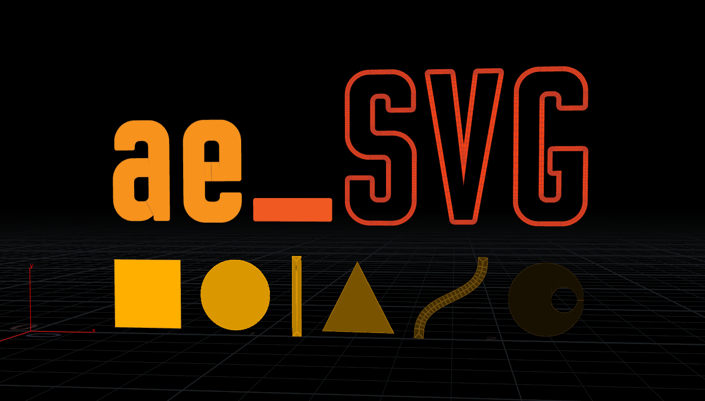

# ae_SVG
Python-based HDAs for importing and exporting SVG files in Houdini

# Installation (Houdini 17.5+)

These SVG tools are included in Aelib (https://github.com/Aeoll/Aelib) - my large Houdini toolkit and HDA collection. I would highly recommend installing Aelib rather than just these SVG tools in isolation.

If you would like to install just these 2 HDAs:
* Download and extract the repository and move it to any location
* Create a folder called 'packages' in your Houdini home directory (e.g C:/Users/MY_USER/Documents/houdini19.0) if it does not exist already
* Copy the AeSVG.json file into the packages folder
* Edit the json file to point to the ae_SVG parent directory (edit the "AESVG" line)
* For more information on how package files work, see [HERE](https://www.sidefx.com/docs/houdini/ref/plugins.html)

Do not perform this install alongside a full Aelib install as you will create duplicate HDAs!

# Usage

## Importer
SOP level HDA which loads SVG files. Tested with a variety of SVG 1.1 files exported from Illustrator and Inkscape.
Features:
- Supports Line, Polyline, Polygon, Circle, Rect and Path elements (Cubic bezier paths - open or closed)
- Loads Fill, Stroke, Stroke-Weight and Opacity data and stores these as Primitive attributes
- Options for outlining strokes, hole-ing compound shapes and converting bezier curves to polygons
- Supports Compound shapes
- Supports path grouping (creates primitive groups)

Current Limitations:
- Does not support 'Ellipse' elements (convert these to bezier paths before saving the SVG)
- Does not support Clipping Paths (Error thrown)

# Exporter
SOP level HDA which saves the contents of a Houdini scene to SVG format
- Usable but not guaranteed stable.
- Supports Polygons, Polylines and Bezier Curves
- Colour and stroke weight (pscale) data are saved in the SVG